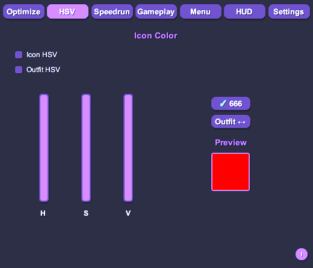
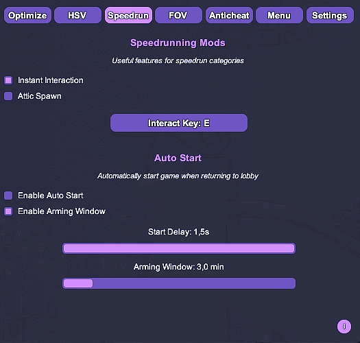
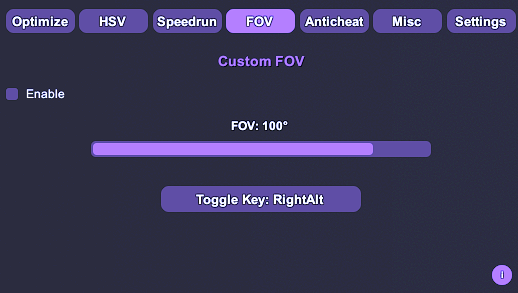
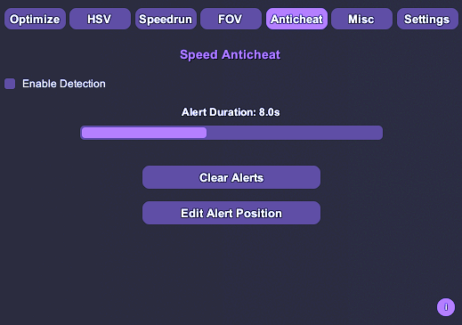
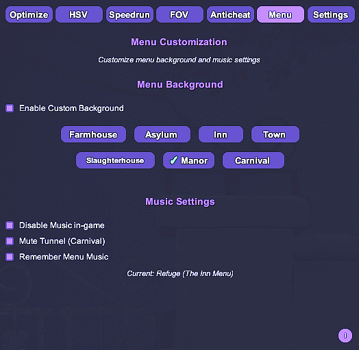
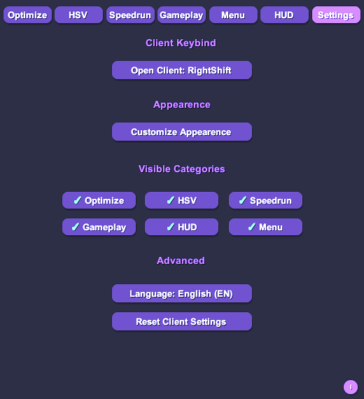

# DevourCore

<p align="center">
  <b>Advanced client for DEVOUR focused on performance, customization, QoL improvements, and speedrunning utilities.</b>
</p>

<p align="center">
  
  
  
  
</p>

<!-- NEW BADGES BELOW -->
<p align="center">
  
  
  
  
  
</p>

---

## Table of Contents

- [Overview](#overview)
- [Installation](#installation)
- [Features](#features)
  - [Optimization](#optimization)
  - [HSV Customization](#hsv-customization)
  - [Speedrun Tools](#speedrun-tools)
  - [Custom FOV](#custom-fov)
  - [Anticheat](#anticheat)
  - [Menu Customization](#menu-customization)
  - [Client Settings](#client-settings)
- [Final Notes](#final-notes)
- [License](#license)

---

## Overview

DevourCore is a feature-rich client for **DEVOUR**, built on top of **MelonLoader**.  
It focuses on:

- Higher FPS and better stability  
- Deep visual and color customization  
- Speedrun-oriented quality-of-life features  
- Basic client-side anticheat utilities

All features are client-side, non-destructive, and intended for educational and customization purposes.

---

## Installation

1. **Install MelonLoader**
   - Download MelonLoader from the official website.
   - Run the installer and select your `DEVOUR.exe`.

2. **Run DEVOUR once**
   - After MelonLoader is installed, start DEVOUR once.
   - This will automatically create the `Mods` folder in the game directory.

3. **Install DevourCore**
   - Go to this repository's **Releases** section.
   - Download **DevourCore.dll**.
   - Place it into:
     ```text
     DEVOUR/Mods/
     ```

4. **Launch DEVOUR**
   - Start the game normally.
   - DevourCore will be loaded automatically by MelonLoader.

---

## Features

Below is an overview of the main modules and what they provide.

---

## Optimization

Performance-focused tools to reduce GPU/CPU load and improve frame rate.


- **Render Distance Control**  
  Reduce unnecessary rendering to gain more FPS.

- **Disable Weather Effects**  
  Turn off weather-related visuals (e.g., rain, snow, particles) for a cleaner and faster experience.

---

## HSV Customization

Fine-grained color control for UI icons and outfits using HSV (Hue, Saturation, Value).



- **666 Icon Color HSV**  
  Adjust the color of the 666 icon via HSV sliders.

- **Outfit HSV**  
  Customize the look of your outfits by changing hue, saturation, and value independently.

---

## Speedrun Tools

Utilities designed specifically to reduce wasted time and increase run consistency.



- **Instant Interaction**  
  Removes interaction delay for faster gameplay flow.

- **Attic Spawn**  
  Forces a consistent spawn position (e.g., attic) for reliable routing.

- **Auto Start**  
  Automatically starts the game when returning to the lobby to avoid time loss.  
  Includes configurable delay and safety window options.

---

## Custom FOV

Customize your field of view beyond in-game limits.



- **FOV Slider**  
  Adjust camera FOV to your preference.

- **Hotkey Toggle**  
  Quickly enable or disable your custom FOV configuration.

---

## Anticheat

Basic local anticheat utilities focused on speed anomaly detection.



- **Speed Cheat Detection**  
  Monitors player movement and highlights abnormal speeds.

- **Alert Management**  
  Configure alert duration and clear alerts when no longer needed.

---

## Menu Customization

Visual and audio customization for the main menu and lobby.



- **Custom Menu Background**  
  Select custom backgrounds per map:
  `Farmhouse, Asylum, Inn, Town, Slaughterhouse, Manor, Carnival`.

- **Music Controls**  
  - Disable in-game music globally.  
  - Remember the selected menu music between sessions.

---

## Client Settings

Global configuration panel for DevourCore.



- **Menu Keybind**  
  Change which key opens the DevourCore menu.

- **Theme Color**  
  Set the overall theme color for the client UI.

- **Visible Categories**  
  Toggle visibility of feature groups such as:
  `Optimize, HSV, Speedrun, FOV, Anticheat, Menu`.

- **Reset Settings**  
  Restore all client settings to their defaults with a single action.

---

## Final Notes

DevourCore is intended for **educational, customization, QoL, and speedrunning purposes only**.  
It operates entirely on the client side and does **not** modify remote servers or online backend systems.

By using this project, you agree to:

- Respect the **EULA** and **terms of service** of DEVOUR and related platforms.  
- Use the client responsibly and at your own risk.  
- Avoid disrupting the experience of other players.

For issues, suggestions, or feature requests, please open an issue on the repository.

---

## License

DevourCore is released under the **GNU General Public License v3.0 (GPL-3.0)**.

See the [`LICENSE`](./LICENSE) file for more details.
