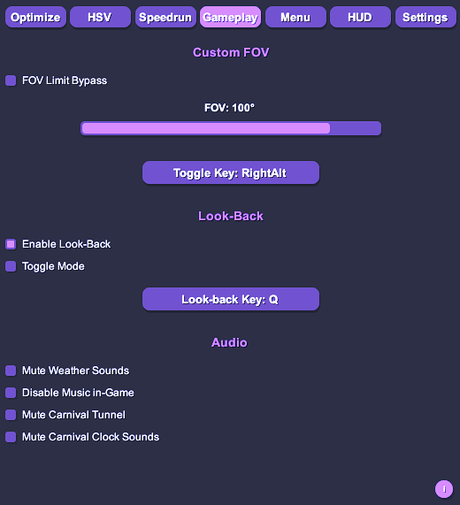
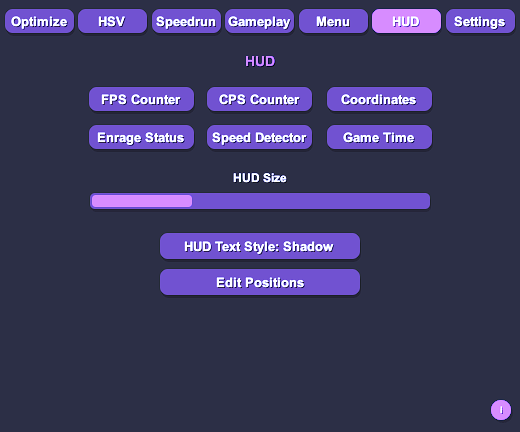
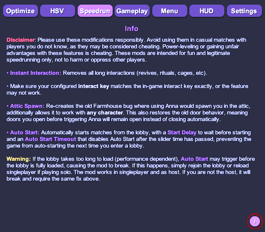

# DevourCore

<p align="center">
  <!-- Top row -->
  <a href="https://store.steampowered.com/app/1274570/DEVOUR/"></a>
  <a href="https://melonwiki.xyz/"></a>
  <a href="./LICENSE"></a>
  <a href="https://github.com/Steany/DevourCore/releases"></a>
</p>

<p align="center" style="margin-top: 10px;">
  <!-- Second row -->
  <a href="https://github.com/Steany/DevourCore/stargazers"></a>
  
  <a href="https://github.com/Steany/DevourCore"></a>
</p>

<p align="center">
  <b>A lightweight client for DEVOUR with QoL features, performance tools, speedrun utilities, and visual customization.</b> 
  <p align="center">
    <a href="https://github.com/Steany/DevourCore/blob/main/READMECN.md"><b>(For Chinese Speakers / 中文版请点击这里)</b></a>
    <br/>
    <a href="https://github.com/Steany/DevourCore/blob/main/READMEPT.md"><b>(For Portuguese Speakers / Para Falantes de Português)</b></a>
  </p>
</p>

---

## Table of Contents
- [Overview](#overview)
- [Installation](#installation)
- [Features](#features)
- [Info System](#info-system)
- [Final Notes](#final-notes)
- [Uninstallation](#uninstallation)
- [License](#license)

---

## Overview

DevourCore is a feature-rich modular client built for DEVOUR using MelonLoader.  
It focuses on performance improvements, visual customization, speedrunning utilities, and general QoL enhancements.

---

## Installation

### 1. Install .NET 6.0  
Download [.NET 6.0](https://dotnet.microsoft.com/en-us/download/dotnet/6.0) if you do not have it already.

### 2. Install MelonLoader  
Download [MelonLoader](https://melonwiki.xyz/#/) and point the installer to `DEVOUR.exe`.

### 3. Run DEVOUR once  
MelonLoader will generate the required folders automatically.

### 4. Install DevourCore  
Download **DevourCore.dll** from the [Releases](https://github.com/Steany/DevourCore/releases) section  
and place it in:

```
DEVOUR/Mods/
```

### 5. Launch the game  
DevourCore will load automatically.

---

## Installation Video

If you prefer a visual walkthrough, you can follow this step-by-step installation video:

<p align="center">
  <a href="https://youtu.be/-xMP3mihvD8">
    
  </a>
</p>

---

## Features

### Optimize

- Render distance slider
- Disable weather effects

---

### HSV

- Icon HSV customization
- Outfit HSV customization
- Supports level 70 to 666 Icons 

---

### Speedrun

- Instant interaction
- Attic spawn
- Auto Start
- Auto Start Timeout
  
---

### Gameplay

- FOV Limit bypass
- Look-Back
- A bunch of audio controls

---

### Menu

- Custom menu background selection for every map
- Remember Menu Music

---

### HUD

- FPS Counter
- CPS Counter
- Coordinates
- Enrage Status
- Speed Detector
- Game Time

All elements are fully customizable.

---

### Settings

- Client Keybind
- Appearance Customization
- Category Visibility Toggles
- Language Selector
- Reset Client Settings

---

## Info System


DevourCore includes an integrated **Info System** displayed as a small **“i” icon** in every major category.  
When you hover your mouse over these icons, a detailed tooltip appears explaining:

- What the feature does  
- Recommended usage  
- Technical behavior  
- Notes, limitations, and warnings if necessary

This system ensures users can fully understand each feature without relying on external documentation.

---

## Final Notes

DevourCore is designed for customization, experimentation, and quality-of-life improvements.  
Please use it responsibly and avoid disrupting other players.

---

## Uninstallation

Removing DevourCore is straightforward and does not require any additional tools.

Simply delete the following folders and files from your **DEVOUR installation directory**:

```
MelonLoader
Mods
Plugins
UserData
UserLibs
version.dll
```

Once these files are removed, DEVOUR will return to its original, unmodded state.

---

## Contact Us

If you have any questions or doubts, feel free to reach out on **Discord**:
- steany  
- queen.mikasa

---

## License

DevourCore is licensed under the **GNU GPL-3.0**.  
See the [LICENSE](./LICENSE) file for more information.
