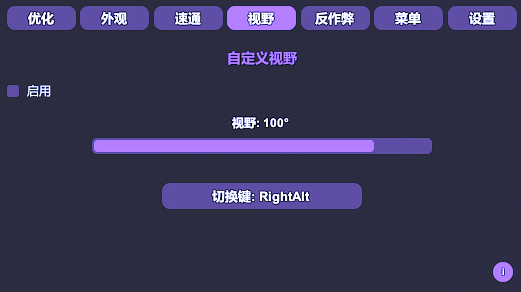
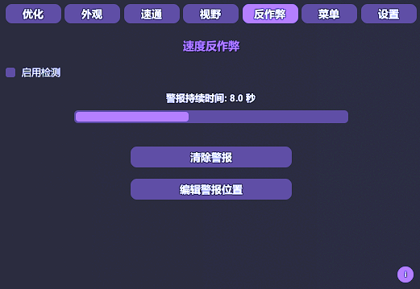
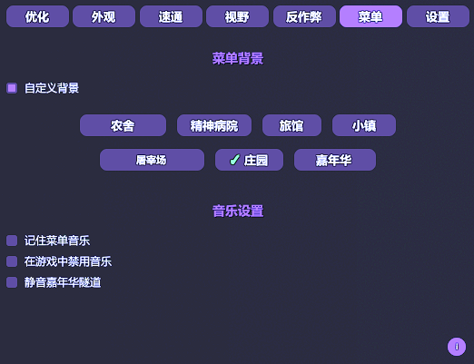

# DevourCore

<p align="center">
  <!-- Top row -->
  <a href="https://store.steampowered.com/app/1274570/DEVOUR/"></a>
  <a href="https://melonwiki.xyz/"></a>
  <a href="./LICENSE"></a>
  <a href="https://github.com/Steany/DevourCore/releases"></a>
</p>

<p align="center" style="margin-top: 10px;">
  <!-- Second row -->
  <a href="https://github.com/Steany/DevourCore/stargazers"></a>
  <a href="https://github.com/Steany/DevourCore/issues"></a>
  <a href="https://github.com/Steany/DevourCore/releases"></a>
  <a href="https://github.com/Steany/DevourCore/releases/latest"></a>
</p>

<p align="center">
  <b>一个轻量级的 DEVOUR 客户端，包含便捷功能（QoL）、性能工具、速通辅助以及视觉自定义。</b>
  <p align="center">
    <a href="https://github.com/Steany/DevourCore"><b>(原始项目链接)</b></a>
  </p>
</p>

---

## 目录
- [概述](#概述)
- [安装](#安装)
- [安装视频](#安装视频)
- [功能](#功能)
- [信息系统](#信息系统)
- [最终说明](#最终说明)
- [如何卸载 DevourCore](#如何卸载-devourcore)
- [联系我们](#联系我们)
- [许可证](#许可证)

---

## 概述

DevourCore 是一个为 DEVOUR 基于 MelonLoader 所构建的模块化高功能客户端。  
它专注于性能优化、视觉自定义、速通工具以及整体游戏体验改进（QoL）。

---

## 安装

### 1. 安装 .NET 6.0  
下载 [.NET 6.0](https://dotnet.microsoft.com/en-us/download/dotnet/6.0) 如果你尚未安装。

### 2. 安装 MelonLoader  
下载 [MelonLoader](https://melonwiki.xyz/#/) 并将安装程序指向 `DEVOUR.exe`。

### 3. 运行一次 DEVOUR  
MelonLoader 会生成必要的文件夹。

### 4. 安装 DevourCore  
从 [Releases](https://github.com/Steany/DevourCore/releases) 下载 **DevourCore.dll** 并将其放置在：

```
DEVOUR/Mods/
```

### 5. 启动游戏  
DevourCore 会自动加载。

---

## 安装视频

如果你更喜欢视频教程，可以观看以下分步安装视频：

<p align="center">
  <a href="https://youtu.be/-xMP3mihvD8">
    
  </a>
</p>

---

## 功能

### 优化
  
- 渲染距离控制  
- 禁用天气效果并静音音频  

### HSV
  
- 等级 70 至 666 图标 HSV 调整  
- 服装 HSV 调整  

### 速通
  
- 即时交互  
- 阁楼出生点  
- 自动开始（可设置延迟）  

### 视野（FOV）
  
- 可调节视野范围  
- 热键切换  

### 反作弊
  
- 移动 / 速度异常检测  
- 可配置警报系统  

### 杂项
  
- 基于地图的菜单背景  
- 多种音频设置  

### 设置
  
- 菜单快捷键绑定  
- 主题自定义  
- 分类开关  
- 完全重置选项  
- 语言切换器  

---

## 信息系统


DevourCore 在每个主要分类旁都提供一个小型 **“i” 信息图标**。  
将鼠标悬停其上时，你会看到：

- 功能介绍  
- 推荐使用方式  
- 技术行为说明  
- 注意事项与限制  

此系统让用户无需额外查阅文档即可理解每项功能。

---

## 最终说明

DevourCore 专为自定义、实验性功能以及游戏便捷性改进而设计。  
请合理使用，避免影响其他玩家。

---

## 如何卸载 DevourCore

卸载 DevourCore 非常简单，并且不需要任何额外工具。

只需在你的 **DEVOUR 安装目录** 中删除以下文件夹与文件：

```
MelonLoader
Mods
Plugins
UserData
UserLibs
version.dll
```

删除完成后，DEVOUR 将恢复为原始的未修改状态。

---

## 联系我们

如果你有任何问题或疑问，欢迎通过 **Discord** 联系我们：
- steany  
- queen.mikasa

---

## 许可证

DevourCore 使用 **GNU GPL-3.0** 许可证发布。  
详情请查看 [LICENSE](./LICENSE) 文件。
