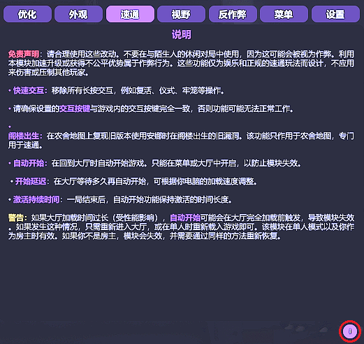

# DevourCore

<p align="center">
  <!-- Top row -->
  <a href="https://store.steampowered.com/app/1274570/DEVOUR/"></a>
  <a href="https://melonwiki.xyz/"></a>
  <a href="./LICENSE"></a>
  <a href="https://github.com/Steany/DevourCore/releases"></a>
</p>

<p align="center" style="margin-top: 10px;">
  <!-- Second row -->
  <a href="https://github.com/Steany/DevourCore/stargazers"></a>
  <a href="https://github.com/Steany/DevourCore/issues"></a>
  <a href="https://github.com/Steany/DevourCore/releases"></a>
  <a href="https://github.com/Steany/DevourCore/releases/latest"></a>
</p>

<p align="center">
  <b>一个轻量级的 DEVOUR 客户端，包含便捷功能（QoL）、性能工具、速通辅助以及视觉自定义。</b> <p align="center">
  <a href="https://github.com/Steany/DevourCore"><b>(原始项目链接)</b></a>
</p>

</p>

---

## 目录
- [概述](#概述)
- [安装](#安装)
- [功能](#功能)
- [最终说明](#最终说明)
- [许可证](#许可证)

---

## 概述

DevourCore 是一个为 DEVOUR 基于 MelonLoader 所构建的模块化高功能客户端。  
它专注于性能优化、视觉自定义、速通工具以及整体游戏体验改进（QoL）。

---

## 安装

### 1. 安装 .NET 6.0  
下载 [.NET 6.0](https://dotnet.microsoft.com/en-us/download/dotnet/6.0) 如果你尚未安装。

### 2. 安装 MelonLoader  
下载 [MelonLoader](https://melonwiki.xyz/#/) 并将安装程序指向 `DEVOUR.exe`。

### 3. 运行一次 DEVOUR  
MelonLoader 会生成必要的文件夹。

### 4. 安装 DevourCore  
从 [Releases](https://github.com/Steany/DevourCore/releases) 页面下载 **DevourCore.dll** 并将其放置在：

```
DEVOUR/Mods/
```

### 5. 启动游戏  
DevourCore 会自动加载。

---

## 功能

### 性能优化
  
- 渲染距离控制  
- 禁用天气效果  

### 自定义
  
- 666 图标 调整  
- 服装 控制  

### 速通工具
  
- 即时交互  
- 阁楼刷新行为调整  
- 自动开始（可设置延迟）  

### 自定义视野
  
- 可调节 
- 热键切换  

### 反作弊监测
  
- 移动/速度异常检测  
- 可配置警告系统  

### 菜单自定义
  
- 基于地图的菜单背景  
- 切换菜单/大厅音乐  

### 客户端设置
  
- 菜单快捷键  
- 主题颜色  
- 分类开关  
- 完全重置选项  

---

## 信息系统


DevourCore 在每个主要功能分类中都提供一个小型 **“i” 信息图标**。  
将鼠标悬停在这些图标上时，会显示对应选项的详细说明，包括：

- 功能用途  
- 推荐使用方式  
- 技术行为说明  
- 注意事项、限制提示等  

此系统可以帮助用户在启用功能前快速了解其作用，无需查阅额外文档。

---

## 最终说明

DevourCore 专为自定义、实验性功能以及游戏便捷性改进而设计。  
请合理使用，避免影响其他玩家。

---

## 许可证

DevourCore 使用 **GNU GPL-3.0** 许可证发布。  
详情请查看 [LICENSE](./LICENSE) 文件。
