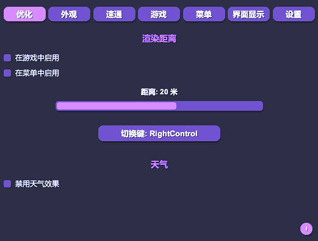
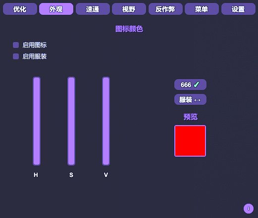
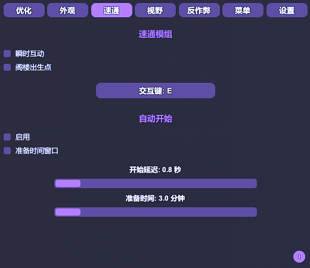
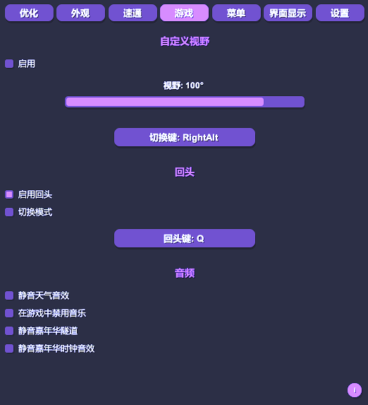
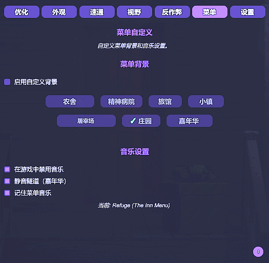
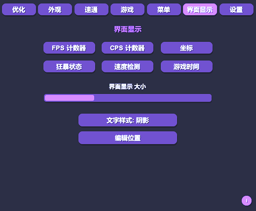
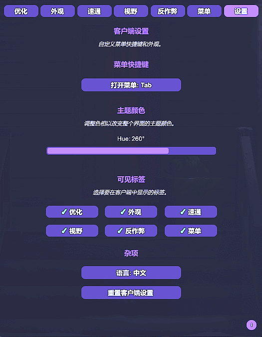
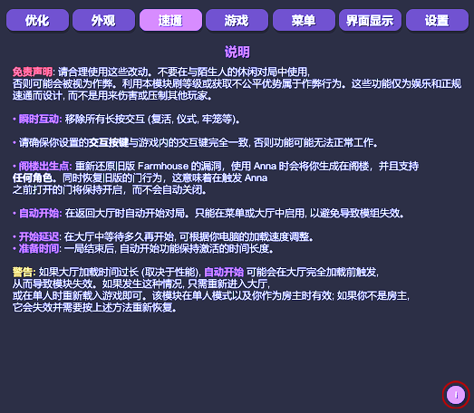

# DevourCore

<p align="center">
  <!-- Top row -->
  <a href="https://store.steampowered.com/app/1274570/DEVOUR/"></a>
  <a href="https://melonwiki.xyz/"></a>
  <a href="./LICENSE"></a>
  <a href="https://github.com/Steany/DevourCore/releases"></a>
</p>

<p align="center" style="margin-top: 10px;">
  <!-- Second row -->
  <a href="https://github.com/Steany/DevourCore/stargazers"></a>
  <a href="https://github.com/Steany/DevourCore/releases"></a>
  <a href="https://github.com/Steany/DevourCore"></a>
</p>

<p align="center">
  <b>一个为 DEVOUR 打造的轻量级客户端，主打体验优化、性能调校、速通辅助和视觉自定义。</b> 
  <p align="center">
    <a href="https://github.com/Steany/DevourCore"><b>前往原始页面</b></a>
  </p>
</p>

---

## 目录
- [项目概览](#项目概览)
- [安装方法](#安装方法)
- [功能一览](#功能一览)
- [信息提示系统](#信息提示系统)
- [最后说明](#最后说明)
- [卸载方法](#卸载方法)
- [许可证](#许可证)

---

## 项目概览

DevourCore 是一个基于 MelonLoader 的 DEVOUR 模块化客户端。  
目标很简单：**提帧数、减卡顿、少折腾、多爽玩**。  
适合追求流畅体验、速通玩法以及个性化设置的玩家。

---

## 安装方法

### 1. 安装 .NET 6.0  
如果你还没装，请先下载 [.NET 6.0](https://dotnet.microsoft.com/en-us/download/dotnet/6.0)。

### 2. 安装 MelonLoader  
下载 [MelonLoader](https://melonwiki.xyz/#/)，安装时选择 `DEVOUR.exe`。

### 3. 启动一次 DEVOUR  
第一次启动会自动生成所需文件夹。

### 4. 安装 DevourCore  
前往 [Releases](https://github.com/Steany/DevourCore/releases) 下载 **DevourCore.dll**，  
然后丢进：

```
DEVOUR/Mods/
```

### 5. 启动游戏  
进游戏即自动加载，无需额外操作。

---

## 安装视频

如果你更喜欢视频教程，可以直接看这个：

<p align="center">
  <a href="https://youtu.be/-xMP3mihvD8">
    
  </a>
</p>

---

## 功能一览

### 性能优化

- 可调渲染距离
- 一键关闭天气特效，稳定帧数

---

### 颜色自定义

- 图标颜色自由调
- 服装 HSV 自定义
- 支持 70–666 等级图标

---

### 速通工具

- 秒交互
- 阁楼出生点
- 自动开局
- 自动开局延迟设置

---

### 玩法增强

- 解除 FOV 限制
- 快速回头
- 多种音效控制

---

### 菜单美化

- 每张地图可单独设置菜单背景
- 菜单音乐记忆功能

---

### 信息显示

- FPS 显示
- CPS 显示
- 坐标显示
- 狂暴状态提示
- 移速检测
- 游戏计时

所有 HUD 元素都可以自由开关和调整。

---

### 客户端设置

- 客户端快捷键
- 界面外观自定义
- 分类显示开关
- 语言切换
- 一键重置设置

---

## 信息提示系统


DevourCore 内置 **信息提示系统**，  
在每个主要分类中都会看到一个小小的 **“i” 图标**。

鼠标悬停后会直接告诉你：

- 这个功能是干嘛的  
- 推荐怎么用  
- 背后的运行逻辑  
- 可能的限制或注意事项  

不用翻文档，新手也能秒懂。

---

## 最后说明

DevourCore 的核心理念只有一个：  
**不破坏游戏，只让体验更爽。**  

请合理使用，别影响其他玩家的正常游戏体验。

---

## 卸载方法

卸载非常简单，不留痕迹。

直接在 **DEVOUR 安装目录** 删除下面这些即可：

```
MelonLoader
Mods
Plugins
UserData
UserLibs
version.dll
```

删完就是原版游戏。

---

## 联系方式

有问题可以在 **Discord** 找我们：
- steany  
- queen.mikasa

---

## 许可证

DevourCore 使用 **GNU GPL-3.0** 协议。  
详情请查看 [LICENSE](./LICENSE) 文件。
