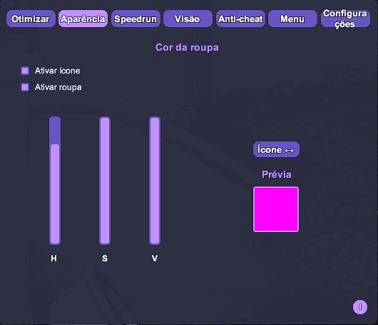
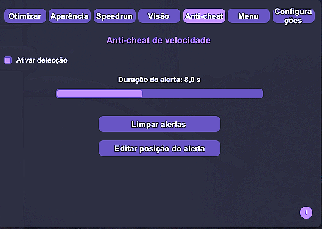

# DevourCore

<p align="center">
  <!-- Top row -->
  <a href="https://store.steampowered.com/app/1274570/DEVOUR/"></a>
  <a href="https://melonwiki.xyz/"></a>
  <a href="./LICENSE"></a>
  <a href="https://github.com/Steany/DevourCore/releases"></a>
</p>

<p align="center" style="margin-top: 10px;">
  <!-- Second row -->
  <a href="https://github.com/Steany/DevourCore/stargazers"></a>
  <a href="https://github.com/Steany/DevourCore/issues"></a>
  <a href="https://github.com/Steany/DevourCore/releases"></a>
  <a href="https://github.com/Steany/DevourCore/releases/latest"></a>
</p>

<p align="center">
  <b>Um cliente DEVOUR leve que inclui recursos de conveniência (QoL), ferramentas de desempenho, suporte a speedrun e personalização visual.</b>
  <p align="center">
    <a href="https://github.com/Steany/DevourCore"><b>(Link do projeto original)</b></a>
  </p>
</p>

---

## Índice
- [Visão Geral](#visão-geral)
- [Instalação](#instalação)
- [Vídeo de Instalação](#vídeo-de-instalação)
- [Recursos](#recursos)
- [Sistema de Informações](#sistema-de-informações)
- [Observações Finais](#observações-finais)
- [Como Desinstalar o DevourCore](#como-desinstalar-o-devourcore)
- [Contato](#contato)
- [Licença](#licença)

---

## Visão Geral

DevourCore é um cliente modular e altamente funcional para DEVOUR, construído sobre o MelonLoader.  
Ele é focado em otimização de desempenho, personalização visual, ferramentas de speedrun e melhorias gerais na experiência do jogo (QoL).

---

## Instalação

### 1. Instalar .NET 6.0  
Baixe o [.NET 6.0](https://dotnet.microsoft.com/en-us/download/dotnet/6.0) se ainda não estiver instalado.

### 2. Instalar o MelonLoader  
Baixe o [MelonLoader](https://melonwiki.xyz/#/) e aponte o instalador para `DEVOUR.exe`.

### 3. Executar o DEVOUR uma vez  
O MelonLoader irá gerar as pastas necessárias.

### 4. Instalar o DevourCore  
Baixe o **DevourCore.dll** na página de [Releases](https://github.com/Steany/DevourCore/releases) e coloque em:

```
DEVOUR/Mods/
```

### 5. Iniciar o jogo  
O DevourCore será carregado automaticamente.

---

## Vídeo de Instalação

Se preferir um tutorial em vídeo, assista ao passo a passo abaixo:

<p align="center">
  <a href="https://youtu.be/-xMP3mihvD8">
    
  </a>
</p>

---

## Recursos

### Otimização
  
- Controle de distância de renderização  
- Desativar efeitos climáticos e silenciar áudio  

### HSV
  
- Ajuste de HSV para ícones de nível 70 até 666  
- Ajuste de HSV para roupas  

### Speedrun
  
- Interação instantânea  
- Spawn no sótão  
- Início automático (com atraso configurável)  

### Campo de Visão (FOV)
  
- Campo de visão ajustável  
- Alternância por tecla de atalho  

### Anticheat
  
- Detecção de movimento / velocidade anormal  
- Sistema de alertas configurável  

### Diversos
  
- Fundos de menu baseados em mapas  
- Múltiplas configurações de áudio  

### Configurações
  
- Atalhos de teclado do menu  
- Personalização de tema  
- Alternadores por categoria  
- Opção de reset completo  
- Seletor de idioma  

---

## Sistema de Informações


O DevourCore fornece um pequeno **ícone de informação “i”** ao lado de cada categoria principal.  
Ao passar o mouse sobre ele, você verá:

- Descrição da funcionalidade  
- Forma de uso recomendada  
- Explicação técnica do comportamento  
- Avisos e limitações  

Esse sistema permite entender cada recurso sem precisar consultar documentação adicional.

---

## Observações Finais

O DevourCore foi projetado para personalização, recursos experimentais e melhorias de conveniência no jogo.  
Utilize de forma responsável e evite impactar negativamente outros jogadores.

---

## Como Desinstalar 

Desinstalar o DevourCore é simples e não requer ferramentas adicionais.

Basta excluir as seguintes pastas e arquivos no **diretório de instalação do DEVOUR**:

```
MelonLoader
Mods
Plugins
UserData
UserLibs
version.dll
```

Após a remoção, o DEVOUR retornará ao estado original, sem modificações.

---

## Contato

Se tiver qualquer dúvida ou problema, entre em contato via **Discord**:
- steany  
- queen.mikasa

---

## Licença

O DevourCore é distribuído sob a licença **GNU GPL-3.0**.  
Para mais detalhes, consulte o arquivo [LICENSE](./LICENSE).
