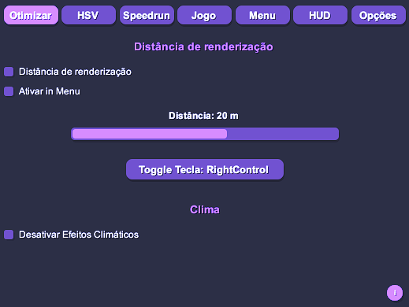
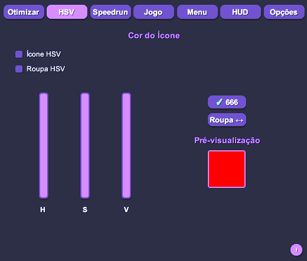
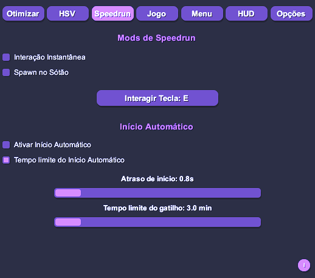
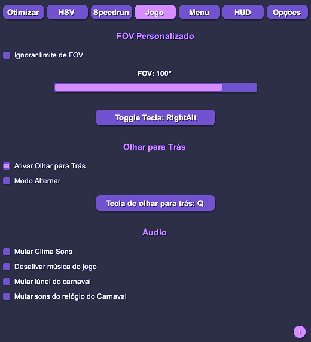
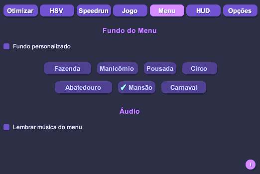
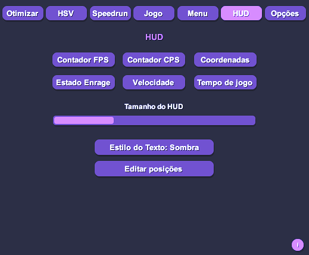
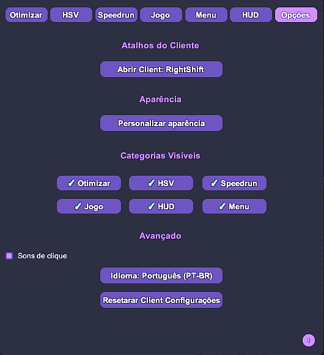
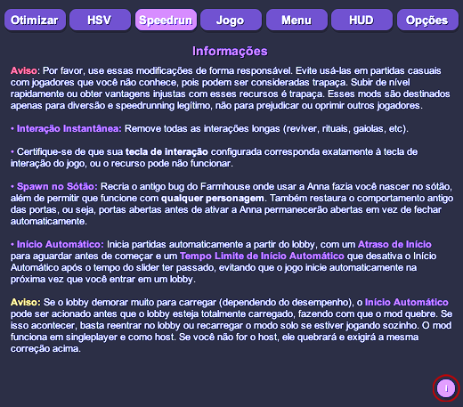

# DevourCore

<p align="center">
  <!-- Top row -->
  <a href="https://store.steampowered.com/app/1274570/DEVOUR/"></a>
  <a href="https://melonwiki.xyz/"></a>
  <a href="./LICENSE"></a>
  <a href="https://github.com/Steany/DevourCore/releases"></a>
</p>

<p align="center" style="margin-top: 10px;">
  <!-- Second row -->
  <a href="https://github.com/Steany/DevourCore/stargazers"></a>
  <a href="https://github.com/Steany/DevourCore/releases"></a>
  <a href="https://github.com/Steany/DevourCore"></a>
</p>

<p align="center">
  <b>Um cliente leve para DEVOUR focado em QoL, otimização de desempenho, ferramentas de speedrun e customização visual.</b> 
  <p align="center">
    <a href="https://github.com/Steany/DevourCore"><b>Ir para a página original</b></a>
  </p>
</p>

---

## Sumário
- [Visão Geral](#visão-geral)
- [Instalação](#instalação)
- [Funcionalidades](#funcionalidades)
- [Sistema de Informações](#sistema-de-informações)
- [Notas Finais](#notas-finais)
- [Desinstalação](#desinstalação)
- [Licença](#licença)

---

## Visão Geral

DevourCore é um cliente modular cheio de recursos feito para DEVOUR usando MelonLoader.  
O foco é simples: **mais FPS, menos stutter, gameplay mais fluida e opções extras de customização**.  
Perfeito para quem curte otimização, speedrun e QoL.

---

## Instalação

### 1. Instalar .NET 6.0  
Se você ainda não tem, baixe o [.NET 6.0](https://dotnet.microsoft.com/en-us/download/dotnet/6.0).

### 2. Instalar MelonLoader  
Baixe o [MelonLoader](https://melonwiki.xyz/#/) e aponte o instalador para `DEVOUR.exe`.

### 3. Abrir o DEVOUR uma vez  
O MelonLoader cria automaticamente todas as pastas necessárias.

### 4. Instalar DevourCore  
Baixe **DevourCore.dll** na aba [Releases](https://github.com/Steany/DevourCore/releases)  
e jogue o arquivo em:

```
DEVOUR/Mods/
```

### 5. Iniciar o jogo  
O DevourCore carrega automaticamente.

---

## Vídeo de Instalação

Se preferir um passo a passo em vídeo:

<p align="center">
  <a href="https://youtu.be/-xMP3mihvD8">
    
  </a>
</p>

---

## Funcionalidades

### Otimização de Desempenho

- Controle de distância de renderização
- Desativar efeitos climáticos para ganhar FPS

---

### Personalização de Cores

- Customização de cores dos ícones
- Customização HSV das roupas
- Suporte a ícones do nível 70 ao 666

---

### Ferramentas de Speedrun

- Interação instantânea
- Spawn no sótão
- Início automático
- Delay configurável do início automático

---

### Melhorias de Gameplay

- Remoção do limite de FOV
- Olhar rápido para trás
- Vários controles de áudio

---

### Personalização do Menu

- Fundo de menu customizado por mapa
- Memória da música do menu

---

### Interface HUD

- Contador de FPS
- Contador de CPS
- Coordenadas
- Status de Enrage
- Detector de velocidade
- Tempo de partida

Todos os elementos do HUD são totalmente configuráveis.

---

### Configurações do Cliente

- Atalho do cliente
- Customização visual
- Alternar categorias
- Seletor de idioma
- Reset completo das configurações

---

## Sistema de Informações


O DevourCore conta com um **Sistema de Informações** integrado,  
mostrado através de um pequeno ícone **“i”** em cada categoria principal.

Ao passar o mouse, você vê:

- O que a função faz  
- Como usar corretamente  
- Comportamento técnico  
- Avisos e limitações, se houver  

Tudo explicado direto no jogo, sem precisar abrir documentação externa.

---

## Notas Finais

O DevourCore foi criado para **melhorar a experiência**, não para quebrar o jogo.  
Use com consciência e evite atrapalhar outros jogadores.

---

## Desinstalação

Remover o DevourCore é rápido e simples.

Basta apagar os seguintes arquivos e pastas da **pasta de instalação do DEVOUR**:

```
MelonLoader
Mods
Plugins
UserData
UserLibs
version.dll
```

Depois disso, o jogo volta ao estado original.

---

## Contato

Dúvidas ou problemas? Chama no **Discord**:
- steany  
- queen.mikasa

---

## Licença

DevourCore é licenciado sob a **GNU GPL-3.0**.  
Veja o arquivo [LICENSE](./LICENSE) para mais detalhes.
